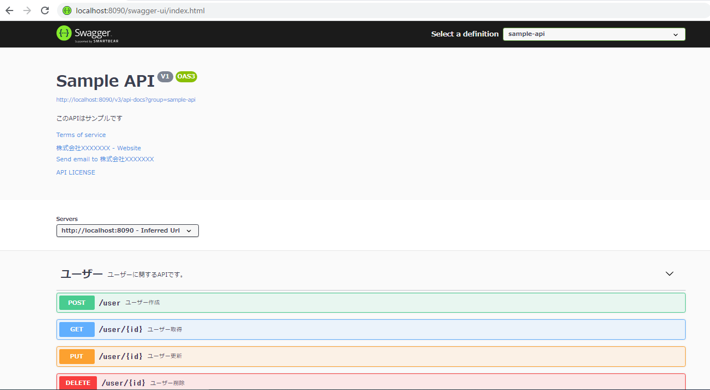

# APIドキュメント作成について

## springdoc を使用したAPIドキュメントについて（以下URL）

[https://github.com/springdoc/springdoc-openapi](https://github.com/springdoc/springdoc-openapi)

## springfoxからspringdocのOAS3へ移行 (develop1環境)
[https://github.com/kenriki/swagger_sample/issues/2](https://github.com/kenriki/swagger_sample/issues/2)

> 必要な情報を記載と画面動作

## springfoxを使用したAPIドキュメント作成について（以下説明）

### 必要なファイル

1. `SwaggerConfig`.java
2. `UserController`.java
3. `UserList`.java

### 実行結果

> ■Swagger2

[swagger2とopenapi3との差分内容](https://github.com/kenriki/swagger_sample/commit/9f614a3269f72718c30d9d9c32c77e2e0f6fd9ee#diff-b20a26de594adab7d1b61c915e4dc2bb2072fae913a3f61b6fe4b14d6aee47b2)
> ■OpenAPI3にバージョンアップ

# 参考
[Spring Boot + SpringFoxでSwaggerを利用してソースからAPIキュメントを生成する](https://qiita.com/NagaokaKenichi/items/b6d4d55a202e6a93d047)

[SpringFoxからspringdoc-openapiに移行してみた](https://qiita.com/yukithm/items/fafc54bc331696b0c333)

[https://springdoc.org/](https://springdoc.org/)

[https://www.vincenzoracca.com/en/blog/framework/spring/openapi/](https://www.vincenzoracca.com/en/blog/framework/spring/openapi/)

-------

